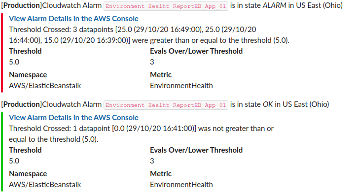

# cloudwatch_to_slack_notifier

## Usage
```
module "cloudwatch_slack_notifier" {
  source = "./"

  slack_channel = "product-auto-monitoring"
  environment   = "production"
}

resource "aws_lambda_permission" "sns" {
  statement_id  = "AllowExecutionFromSNS"
  action        = "lambda:InvokeFunction"
  function_name = module.cloudwatch_slack_notifier.notification_lambda.name
  principal     = "sns.amazonaws.com"
  source_arn    = aws_sns_topic.cloudwatch.arn
}

resource "aws_sns_topic" "cloudwatch" {
  name = "cloudwatch_alarms"
}

resource "aws_sns_topic_subscription" "cloudwatch" {
  topic_arn = aws_sns_topic.cloudwatch.arn
  protocol  = "lambda"
  endpoint  = module.cloudwatch_slack_notifier.notification_lambda..arn
}

module "rds_alarms_01" {
  source  = "terraform-aws-modules/cloudwatch/aws//modules/metric-alarms-by-multiple-dimensions"
  version = "~> 1.0"

  alarm_name          = "CPU Usage"
  alarm_description   = "CPU Usage is too high"
  comparison_operator = "GreaterThanOrEqualToThreshold"
  evaluation_periods  = 3
  threshold           = 90
  period              = 300
  unit                = "Percent"

  namespace   = "AWS/RDS"
  metric_name = "CPUUtilization"
  statistic   = "Average"

  dimensions = {
    "RDS_DB_01" = {
      DBInstanceIdentifier = "<DB ID>"
    },
  }

  alarm_actions             = [aws_sns_topic.cloudwatch.arn]
  ok_actions                = [aws_sns_topic.cloudwatch.arn]
  insufficient_data_actions = [aws_sns_topic.cloudwatch.arn]
}
```

### How it looks in Slack


## Requirements

No requirements.

## Providers

| Name | Version |
|------|---------|
| <a name="provider_archive"></a> [archive](#provider\_archive) | n/a |
| <a name="provider_aws"></a> [aws](#provider\_aws) | n/a |

## Modules

No modules.

## Resources

| Name | Type |
|------|------|
| [aws_cloudwatch_log_group.log_group](https://registry.terraform.io/providers/hashicorp/aws/latest/docs/resources/cloudwatch_log_group) | resource |
| [aws_iam_policy.lambda](https://registry.terraform.io/providers/hashicorp/aws/latest/docs/resources/iam_policy) | resource |
| [aws_iam_role.iam_for_lambda](https://registry.terraform.io/providers/hashicorp/aws/latest/docs/resources/iam_role) | resource |
| [aws_iam_role_policy_attachment.lambda](https://registry.terraform.io/providers/hashicorp/aws/latest/docs/resources/iam_role_policy_attachment) | resource |
| [aws_lambda_function.cloudwatch_slack_notifier](https://registry.terraform.io/providers/hashicorp/aws/latest/docs/resources/lambda_function) | resource |
| [archive_file.init](https://registry.terraform.io/providers/hashicorp/archive/latest/docs/data-sources/file) | data source |
| [aws_caller_identity.current](https://registry.terraform.io/providers/hashicorp/aws/latest/docs/data-sources/caller_identity) | data source |
| [aws_iam_policy_document.lambda](https://registry.terraform.io/providers/hashicorp/aws/latest/docs/data-sources/iam_policy_document) | data source |
| [aws_region.current](https://registry.terraform.io/providers/hashicorp/aws/latest/docs/data-sources/region) | data source |

## Inputs

| Name | Description | Type | Default | Required |
|------|-------------|------|---------|:--------:|
| <a name="input_environment"></a> [environment](#input\_environment) | Environment name. | `string` | n/a | yes |
| <a name="input_lambda_function_name"></a> [lambda\_function\_name](#input\_lambda\_function\_name) | Lambda function name | `string` | `"slack_notifier"` | no |
| <a name="input_lambda_timeout"></a> [lambda\_timeout](#input\_lambda\_timeout) | Lambda function name | `string` | `"15"` | no |
| <a name="input_retention_in_days"></a> [retention\_in\_days](#input\_retention\_in\_days) | Lambda function logs retention in days. | `string` | `"30"` | no |
| <a name="input_slack_channel"></a> [slack\_channel](#input\_slack\_channel) | Slack channel. | `string` | `"monitoring"` | no |
| <a name="input_ssm_slack_webhook"></a> [ssm\_slack\_webhook](#input\_ssm\_slack\_webhook) | SSM parameter name to obtain slack webhook. | `string` | `"/slack_notifier/webhook"` | no |

## Outputs

| Name | Description |
|------|-------------|
| <a name="output_lambda"></a> [lambda](#output\_lambda) | n/a |
